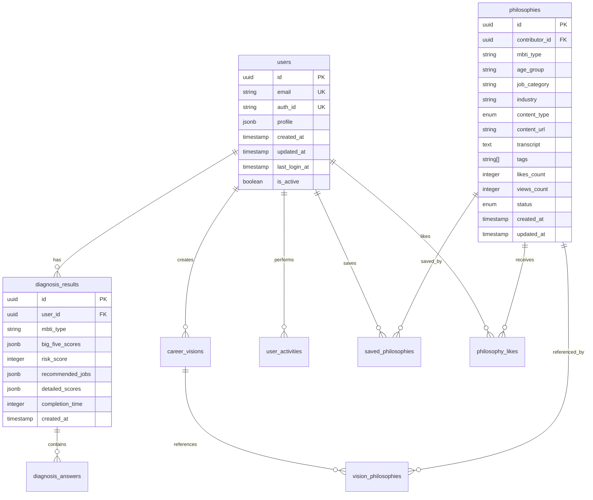

# Cool Career データベース設計書

## 概要
Cool Careerのデータベース設計書です。PostgreSQL（Supabase）を使用し、将来的な拡張性を考慮した設計となっています。

## データベース構成図



## テーブル定義

### 1. users（ユーザー）

| カラム名 | データ型 | NULL | デフォルト | 説明 |
|---------|----------|------|-----------|------|
| id | UUID | NO | gen_random_uuid() | 主キー |
| email | VARCHAR(255) | NO | - | メールアドレス（ユニーク） |
| auth_id | VARCHAR(255) | NO | - | Supabase Auth ID |
| profile | JSONB | YES | {} | プロフィール情報 |
| created_at | TIMESTAMP | NO | CURRENT_TIMESTAMP | 作成日時 |
| updated_at | TIMESTAMP | NO | CURRENT_TIMESTAMP | 更新日時 |
| last_login_at | TIMESTAMP | YES | - | 最終ログイン日時 |
| is_active | BOOLEAN | NO | true | アクティブフラグ |

**profile JSONB構造:**
```json
{
  "nickname": "string",
  "age_group": "20s_early|20s_late|30s|40s|50s_plus",
  "occupation": "student|working|job_hunting|other",
  "industry": "string",
  "avatar_url": "string",
  "preferences": {
    "notification": true,
    "newsletter": true,
    "public_profile": false
  }
}
```

**インデックス:**
- email (UNIQUE)
- auth_id (UNIQUE)
- created_at

### 2. diagnosis_results（診断結果）

| カラム名 | データ型 | NULL | デフォルト | 説明 |
|---------|----------|------|-----------|------|
| id | UUID | NO | gen_random_uuid() | 主キー |
| user_id | UUID | YES | - | ユーザーID（FK） |
| mbti_type | VARCHAR(4) | NO | - | MBTIタイプ |
| big_five_scores | JSONB | NO | - | ビッグファイブスコア |
| risk_score | INTEGER | NO | - | 社畜化リスクスコア(0-100) |
| recommended_jobs | JSONB | NO | - | 推奨職種リスト |
| detailed_scores | JSONB | NO | - | 詳細スコア |
| completion_time | INTEGER | NO | - | 診断完了時間（秒） |
| created_at | TIMESTAMP | NO | CURRENT_TIMESTAMP | 診断日時 |

**big_five_scores JSONB構造:**
```json
{
  "openness": 75,
  "conscientiousness": 82,
  "extraversion": 45,
  "agreeableness": 68,
  "neuroticism": 35
}
```

**recommended_jobs JSONB構造:**
```json
[
  {
    "job_title": "データサイエンティスト",
    "match_score": 95,
    "reasons": ["論理的思考力", "分析力", "独立して働ける"]
  }
]
```

**detailed_scores JSONB構造:**
```json
{
  "e_i_score": 35,  // E-I軸のスコア（0-100）
  "s_n_score": 78,  // S-N軸のスコア
  "t_f_score": 82,  // T-F軸のスコア
  "j_p_score": 65,  // J-P軸のスコア
  "stress_factors": {
    "overtime_resistance": 20,
    "rejection_ability": 15,
    "perfectionism": 85,
    "approval_seeking": 70,
    "work_life_balance": 30
  }
}
```

**インデックス:**
- user_id
- mbti_type
- created_at
- risk_score

### 3. diagnosis_answers（診断回答）

| カラム名 | データ型 | NULL | デフォルト | 説明 |
|---------|----------|------|-----------|------|
| id | UUID | NO | gen_random_uuid() | 主キー |
| diagnosis_result_id | UUID | NO | - | 診断結果ID（FK） |
| question_id | INTEGER | NO | - | 質問ID |
| answer | INTEGER | NO | - | 回答（選択肢番号） |
| answered_at | TIMESTAMP | NO | CURRENT_TIMESTAMP | 回答日時 |

**インデックス:**
- diagnosis_result_id
- question_id

### 4. philosophies（哲学データベース）

| カラム名 | データ型 | NULL | デフォルト | 説明 |
|---------|----------|------|-----------|------|
| id | UUID | NO | gen_random_uuid() | 主キー |
| contributor_id | UUID | YES | - | 投稿者ID（FK） |
| mbti_type | VARCHAR(4) | NO | - | MBTIタイプ |
| age_group | VARCHAR(20) | NO | - | 年代 |
| job_category | VARCHAR(100) | NO | - | 職種カテゴリ |
| industry | VARCHAR(100) | NO | - | 業界 |
| content_type | ENUM | NO | - | コンテンツ種別 |
| content_url | TEXT | NO | - | コンテンツURL |
| thumbnail_url | TEXT | YES | - | サムネイルURL |
| transcript | TEXT | YES | - | 文字起こし/本文 |
| title | VARCHAR(200) | NO | - | タイトル |
| summary | TEXT | NO | - | 要約（200字） |
| tags | TEXT[] | NO | {} | タグ配列 |
| likes_count | INTEGER | NO | 0 | いいね数 |
| views_count | INTEGER | NO | 0 | 閲覧数 |
| status | ENUM | NO | 'pending' | ステータス |
| metadata | JSONB | YES | {} | メタデータ |
| created_at | TIMESTAMP | NO | CURRENT_TIMESTAMP | 作成日時 |
| updated_at | TIMESTAMP | NO | CURRENT_TIMESTAMP | 更新日時 |

**content_type ENUM:**
- video
- audio
- text

**status ENUM:**
- pending（承認待ち）
- approved（承認済み）
- rejected（却下）
- archived（アーカイブ）

**metadata JSONB構造:**
```json
{
  "duration": 180,  // 動画/音声の長さ（秒）
  "language": "ja",
  "has_subtitles": true,
  "career_changes": 2,  // 転職回数
  "work_style": ["remote", "flexible"],
  "key_message": "失敗を恐れずチャレンジすることの大切さ"
}
```

**インデックス:**
- contributor_id
- mbti_type
- age_group
- job_category
- status
- created_at
- likes_count
- tags (GIN)

### 5. career_visions（キャリアビジョン）

| カラム名 | データ型 | NULL | デフォルト | 説明 |
|---------|----------|------|-----------|------|
| id | UUID | NO | gen_random_uuid() | 主キー |
| user_id | UUID | NO | - | ユーザーID（FK） |
| title | VARCHAR(200) | NO | - | ビジョンタイトル |
| statement | TEXT | NO | - | ビジョンステートメント |
| action_guidelines | JSONB | NO | - | 行動指針 |
| goals | JSONB | YES | - | 目標設定 |
| is_public | BOOLEAN | NO | false | 公開フラグ |
| version | INTEGER | NO | 1 | バージョン番号 |
| created_at | TIMESTAMP | NO | CURRENT_TIMESTAMP | 作成日時 |
| updated_at | TIMESTAMP | NO | CURRENT_TIMESTAMP | 更新日時 |

**action_guidelines JSONB構造:**
```json
[
  {
    "order": 1,
    "guideline": "技術を通じて社会に価値を提供する",
    "description": "最新技術を学び続け、それを実践に活かす"
  }
]
```

**goals JSONB構造:**
```json
{
  "short_term": [  // 1年以内
    "プログラミングスキルの向上",
    "オープンソースへの貢献"
  ],
  "mid_term": [    // 3年以内
    "テックリードとしてチームを牽引",
    "技術カンファレンスでの登壇"
  ],
  "long_term": [   // 5年以上
    "CTOとして組織の技術戦略を策定",
    "技術教育プログラムの立ち上げ"
  ]
}
```

**インデックス:**
- user_id
- created_at
- is_public

### 6. vision_philosophies（ビジョン参照哲学）

| カラム名 | データ型 | NULL | デフォルト | 説明 |
|---------|----------|------|-----------|------|
| id | UUID | NO | gen_random_uuid() | 主キー |
| vision_id | UUID | NO | - | ビジョンID（FK） |
| philosophy_id | UUID | NO | - | 哲学ID（FK） |
| influence_level | INTEGER | NO | - | 影響度（1-5） |
| created_at | TIMESTAMP | NO | CURRENT_TIMESTAMP | 作成日時 |

**インデックス:**
- vision_id
- philosophy_id
- UNIQUE(vision_id, philosophy_id)

### 7. user_activities（ユーザーアクティビティ）

| カラム名 | データ型 | NULL | デフォルト | 説明 |
|---------|----------|------|-----------|------|
| id | UUID | NO | gen_random_uuid() | 主キー |
| user_id | UUID | NO | - | ユーザーID（FK） |
| action_type | VARCHAR(50) | NO | - | アクション種別 |
| target_type | VARCHAR(50) | YES | - | 対象種別 |
| target_id | UUID | YES | - | 対象ID |
| metadata | JSONB | YES | {} | メタデータ |
| created_at | TIMESTAMP | NO | CURRENT_TIMESTAMP | 作成日時 |

**action_type例:**
- diagnosis_start
- diagnosis_complete
- philosophy_view
- philosophy_like
- vision_create
- vision_update
- share_result

**インデックス:**
- user_id
- action_type
- created_at
- target_type, target_id

### 8. saved_philosophies（保存した哲学）

| カラム名 | データ型 | NULL | デフォルト | 説明 |
|---------|----------|------|-----------|------|
| id | UUID | NO | gen_random_uuid() | 主キー |
| user_id | UUID | NO | - | ユーザーID（FK） |
| philosophy_id | UUID | NO | - | 哲学ID（FK） |
| memo | TEXT | YES | - | メモ |
| created_at | TIMESTAMP | NO | CURRENT_TIMESTAMP | 保存日時 |

**インデックス:**
- user_id
- philosophy_id
- UNIQUE(user_id, philosophy_id)

### 9. philosophy_likes（哲学へのいいね）

| カラム名 | データ型 | NULL | デフォルト | 説明 |
|---------|----------|------|-----------|------|
| id | UUID | NO | gen_random_uuid() | 主キー |
| user_id | UUID | NO | - | ユーザーID（FK） |
| philosophy_id | UUID | NO | - | 哲学ID（FK） |
| created_at | TIMESTAMP | NO | CURRENT_TIMESTAMP | いいね日時 |

**インデックス:**
- user_id
- philosophy_id
- UNIQUE(user_id, philosophy_id)

## ビュー定義

### 1. v_user_diagnosis_summary
最新の診断結果サマリー
```sql
CREATE VIEW v_user_diagnosis_summary AS
SELECT 
    u.id as user_id,
    u.email,
    dr.mbti_type,
    dr.risk_score,
    dr.created_at as last_diagnosis_at,
    COUNT(dr2.id) as total_diagnosis_count
FROM users u
LEFT JOIN LATERAL (
    SELECT * FROM diagnosis_results 
    WHERE user_id = u.id 
    ORDER BY created_at DESC 
    LIMIT 1
) dr ON true
LEFT JOIN diagnosis_results dr2 ON u.id = dr2.user_id
GROUP BY u.id, u.email, dr.mbti_type, dr.risk_score, dr.created_at;
```

### 2. v_popular_philosophies
人気の哲学コンテンツ
```sql
CREATE VIEW v_popular_philosophies AS
SELECT 
    p.*,
    u.profile->>'nickname' as contributor_name,
    (p.likes_count * 2 + p.views_count) as popularity_score
FROM philosophies p
LEFT JOIN users u ON p.contributor_id = u.id
WHERE p.status = 'approved'
ORDER BY popularity_score DESC;
```

## インデックス戦略

### 検索用インデックス
```sql
-- 全文検索用
CREATE INDEX idx_philosophies_fulltext ON philosophies 
USING GIN (to_tsvector('japanese', title || ' ' || transcript));

-- タグ検索用
CREATE INDEX idx_philosophies_tags ON philosophies USING GIN (tags);

-- 複合インデックス
CREATE INDEX idx_philosophies_search ON philosophies 
(mbti_type, age_group, job_category, status);
```

### パフォーマンス用インデックス
```sql
-- ユーザーの最新診断取得用
CREATE INDEX idx_diagnosis_user_created ON diagnosis_results 
(user_id, created_at DESC);

-- アクティビティ分析用
CREATE INDEX idx_activities_user_action_created ON user_activities 
(user_id, action_type, created_at DESC);
```

## セキュリティ設定

### Row Level Security (RLS)
```sql
-- users table
ALTER TABLE users ENABLE ROW LEVEL SECURITY;

CREATE POLICY "Users can view own profile" ON users
    FOR SELECT USING (auth.uid() = auth_id);

CREATE POLICY "Users can update own profile" ON users
    FOR UPDATE USING (auth.uid() = auth_id);

-- diagnosis_results table
ALTER TABLE diagnosis_results ENABLE ROW LEVEL SECURITY;

CREATE POLICY "Users can view own diagnosis" ON diagnosis_results
    FOR SELECT USING (
        user_id IN (SELECT id FROM users WHERE auth_id = auth.uid())
    );

-- philosophies table (approved content is public)
ALTER TABLE philosophies ENABLE ROW LEVEL SECURITY;

CREATE POLICY "Anyone can view approved philosophies" ON philosophies
    FOR SELECT USING (status = 'approved');

CREATE POLICY "Contributors can edit own philosophies" ON philosophies
    FOR UPDATE USING (
        contributor_id IN (SELECT id FROM users WHERE auth_id = auth.uid())
    );
```

## バックアップとメンテナンス

### バックアップ戦略
- **自動バックアップ**: Supabaseの日次自動バックアップ
- **ポイントインタイムリカバリ**: 過去7日間の任意の時点に復元可能
- **定期エクスポート**: 月次で全データをS3にエクスポート

### メンテナンスタスク
```sql
-- 定期的な統計情報更新
ANALYZE;

-- 不要なアクティビティログの削除（6ヶ月以上前）
DELETE FROM user_activities 
WHERE created_at < NOW() - INTERVAL '6 months';

-- いいね数の定期的な再集計
UPDATE philosophies p
SET likes_count = (
    SELECT COUNT(*) FROM philosophy_likes 
    WHERE philosophy_id = p.id
);
```

## 将来の拡張計画

### Phase 2で追加予定
- **teams**: 企業向けチーム管理
- **mentoring_sessions**: メンタリングセッション管理
- **career_paths**: キャリアパス追跡

### Phase 3で追加予定
- **ai_conversations**: AIチャット履歴
- **company_cultures**: 企業文化データベース
- **skill_assessments**: スキル評価

## パフォーマンス目標
- 診断結果の取得: < 100ms
- 哲学検索: < 200ms
- 統計情報の集計: < 500ms
- 同時接続数: 1,000ユーザー