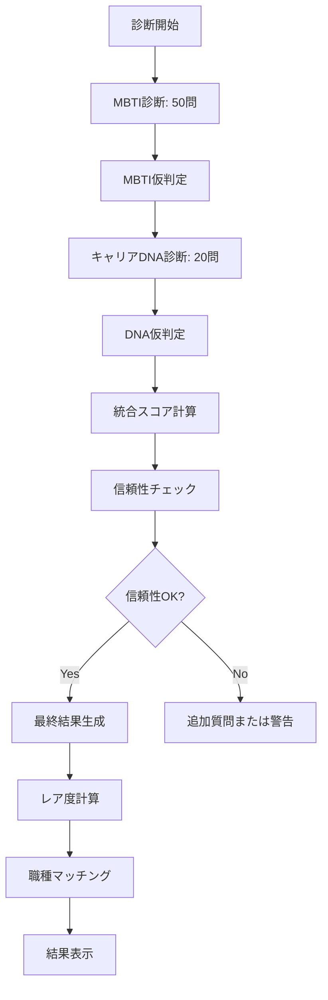

# Cool Career 診断アルゴリズム仕様書

## 概要
MBTI × キャリアDNA = 80タイプ診断を実現するためのアルゴリズム詳細仕様です。70問の質問から正確にユーザーのタイプを判定し、信頼性の高い結果を提供します。

## アルゴリズム全体構造

### 診断フロー


## MBTI判定アルゴリズム（50問）

### 1. 質問構成
```yaml
E-I軸（外向-内向）: 12問
  - 社交性: 4問
  - エネルギー源: 4問
  - 行動パターン: 4問

S-N軸（感覚-直観）: 12問
  - 情報処理: 4問
  - 学習スタイル: 4問
  - 問題解決: 4問

T-F軸（思考-感情）: 13問
  - 意思決定: 5問
  - 価値観: 4問
  - 対人関係: 4問

J-P軸（判断-知覚）: 13問
  - 計画性: 5問
  - 柔軟性: 4問
  - 時間管理: 4問
```

### 2. スコアリング方式

#### 基本スコア計算
```typescript
interface MBTIScore {
  E_I: number  // -100 (極度のI) ～ +100 (極度のE)
  S_N: number  // -100 (極度のN) ～ +100 (極度のS)
  T_F: number  // -100 (極度のF) ～ +100 (極度のT)
  J_P: number  // -100 (極度のP) ～ +100 (極度のJ)
}

function calculateAxisScore(answers: Answer[], axis: Axis): number {
  let score = 0
  let weight = 0
  
  answers.forEach(answer => {
    // 回答時間による重み付け
    const timeWeight = getTimeWeight(answer.responseTime)
    
    // 一貫性による重み付け
    const consistencyWeight = getConsistencyWeight(answer, allAnswers)
    
    // 最終的な重み
    const finalWeight = answer.weight * timeWeight * consistencyWeight
    
    score += answer.value * finalWeight
    weight += finalWeight
  })
  
  return (score / weight) * 100
}
```

#### 回答時間による重み付け
```typescript
function getTimeWeight(responseTime: number): number {
  // 理想的な回答時間: 3-10秒
  if (responseTime < 1000) return 0.7  // 1秒未満: 適当に答えた可能性
  if (responseTime < 3000) return 0.9  // 1-3秒: やや早い
  if (responseTime <= 10000) return 1.0  // 3-10秒: 理想的
  if (responseTime <= 20000) return 0.95  // 10-20秒: 考えすぎ
  return 0.8  // 20秒以上: 迷いすぎ
}
```

#### 一貫性チェック
```typescript
interface ConsistencyCheck {
  questionPairs: Array<[number, number]>  // 関連する質問のペア
  expectedCorrelation: number  // 期待される相関
}

const consistencyChecks: ConsistencyCheck[] = [
  {
    questionPairs: [[1, 15], [3, 18]],  // 同じ軸の異なる側面
    expectedCorrelation: 0.7
  }
]

function getConsistencyWeight(
  answer: Answer, 
  allAnswers: Answer[]
): number {
  // 関連質問との回答の一貫性をチェック
  const consistency = checkConsistency(answer, allAnswers)
  
  if (consistency > 0.8) return 1.0
  if (consistency > 0.6) return 0.9
  if (consistency > 0.4) return 0.8
  return 0.7
}
```

### 3. MBTI型の決定
```typescript
function determineMBTIType(scores: MBTIScore): string {
  let type = ""
  
  // 各軸で明確な傾向がある場合のみ判定
  type += scores.E_I > 10 ? "E" : scores.E_I < -10 ? "I" : "X"
  type += scores.S_N > 10 ? "S" : scores.S_N < -10 ? "N" : "X"
  type += scores.T_F > 10 ? "T" : scores.T_F < -10 ? "F" : "X"
  type += scores.J_P > 10 ? "J" : scores.J_P < -10 ? "P" : "X"
  
  // 不明確な軸がある場合の処理
  if (type.includes("X")) {
    return handleAmbiguousType(type, scores)
  }
  
  return type
}
```

## キャリアDNA判定アルゴリズム（20問）

### 1. 質問構成
```yaml
価値観（5問）:
  - 仕事の意味
  - 成功の定義
  - モチベーション源
  - 理想の環境
  - 避けたいこと

行動傾向（5問）:
  - 問題解決スタイル
  - チーム内での役割
  - ストレス対処法
  - 学習方法
  - 意思決定プロセス

将来像（5問）:
  - 5年後の理想
  - キャリアゴール
  - 成長の方向性
  - 社会への貢献
  - ライフバランス

経験（5問）:
  - 過去の成功体験
  - 挫折経験
  - 得意だったこと
  - 楽しかった活動
  - 影響を受けた人
```

### 2. DNA スコアリング

#### マルチラベル方式
```typescript
interface DNAScores {
  pioneer: number     // 0-100
  builder: number     // 0-100
  specialist: number  // 0-100
  connector: number   // 0-100
  guardian: number    // 0-100
}

function calculateDNAScores(answers: DNAAnswer[]): DNAScores {
  const scores: DNAScores = {
    pioneer: 0,
    builder: 0,
    specialist: 0,
    connector: 0,
    guardian: 0
  }
  
  answers.forEach(answer => {
    // 各選択肢は複数のDNAにポイントを付与
    answer.dnaPoints.forEach(point => {
      scores[point.dna] += point.value * answer.weight
    })
  })
  
  // 正規化（合計が100になるように）
  return normalizeScores(scores)
}
```

#### DNA判定ロジック
```typescript
interface DNAResult {
  primary: DNAType      // メインDNA（最も強い）
  secondary?: DNAType   // サブDNA（2番目に強い）
  tertiary?: DNAType    // 第3DNA（潜在的）
  distribution: DNAScores
}

function determineDNA(scores: DNAScores): DNAResult {
  const sorted = Object.entries(scores)
    .sort(([,a], [,b]) => b - a)
  
  const result: DNAResult = {
    primary: sorted[0][0] as DNAType,
    distribution: scores
  }
  
  // サブDNAの判定（メインの50%以上のスコア）
  if (sorted[1][1] >= sorted[0][1] * 0.5) {
    result.secondary = sorted[1][0] as DNAType
  }
  
  // 第3DNAの判定（メインの30%以上のスコア）
  if (sorted[2][1] >= sorted[0][1] * 0.3) {
    result.tertiary = sorted[2][0] as DNAType
  }
  
  return result
}
```

## 統合アルゴリズム

### 1. 80タイプの生成
```typescript
interface CombinedType {
  code: string          // "INTJ-P"
  name: string          // "革新的な戦略家"
  mbti: MBTIType
  dna: DNAResult
  confidence: number    // 診断の確信度
  rarity: RarityLevel
}

function generateCombinedType(
  mbti: MBTIType, 
  dna: DNAResult
): CombinedType {
  const code = `${mbti}-${dna.primary.charAt(0).toUpperCase()}`
  const name = getTypeName(mbti, dna.primary)
  const confidence = calculateConfidence(mbtiScores, dnaScores)
  const rarity = calculateRarity(mbti, dna.primary)
  
  return {
    code,
    name,
    mbti,
    dna,
    confidence,
    rarity
  }
}
```

### 2. 信頼性スコア計算
```typescript
function calculateConfidence(
  mbtiScores: MBTIScore,
  dnaScores: DNAScores,
  answers: Answer[]
): number {
  let confidence = 100
  
  // MBTI軸の明確性
  const mbtiClarity = calculateMBTIClarity(mbtiScores)
  confidence *= mbtiClarity
  
  // DNA分布の明確性
  const dnaClarity = calculateDNAClarity(dnaScores)
  confidence *= dnaClarity
  
  // 回答の一貫性
  const consistency = calculateOverallConsistency(answers)
  confidence *= consistency
  
  // 回答時間の適切性
  const timeAppropriate = calculateTimeAppropriateness(answers)
  confidence *= timeAppropriate
  
  return Math.round(confidence)
}

function calculateMBTIClarity(scores: MBTIScore): number {
  // 各軸のスコアが明確か（中間値でないか）
  const clarities = [
    Math.abs(scores.E_I) / 100,
    Math.abs(scores.S_N) / 100,
    Math.abs(scores.T_F) / 100,
    Math.abs(scores.J_P) / 100
  ]
  
  return clarities.reduce((a, b) => a + b) / 4
}
```

## レア度計算アルゴリズム

### 1. 基礎レア度
```typescript
// 実データに基づくMBTI分布（%）
const MBTI_DISTRIBUTION = {
  'INTJ': 2.1,
  'INTP': 3.3,
  'ENTJ': 1.8,
  'ENTP': 3.2,
  'INFJ': 1.5,
  'INFP': 4.4,
  'ENFJ': 2.5,
  'ENFP': 8.1,
  'ISTJ': 11.6,
  'ISFJ': 13.8,
  'ESTJ': 8.7,
  'ESFJ': 12.3,
  'ISTP': 5.4,
  'ISFP': 8.8,
  'ESTP': 4.3,
  'ESFP': 8.5
}

// 500人データに基づくDNA分布（%）
const DNA_DISTRIBUTION = {
  'Pioneer': 15,
  'Builder': 25,
  'Specialist': 30,
  'Connector': 20,
  'Guardian': 10
}
```

### 2. レア度計算式
```typescript
interface Rarity {
  percentage: number
  level: RarityLevel
  rank: number  // 80タイプ中の順位
}

function calculateRarity(mbti: string, dna: string): Rarity {
  // 基礎出現率
  const baseRate = (MBTI_DISTRIBUTION[mbti] / 100) * 
                   (DNA_DISTRIBUTION[dna] / 100) * 100
  
  // 組み合わせによる補正
  const synergyFactor = getSynergyFactor(mbti, dna)
  const adjustedRate = baseRate * synergyFactor
  
  // レベル判定
  const level = determineRarityLevel(adjustedRate)
  
  // 全80タイプ中の順位
  const rank = calculateRank(mbti, dna)
  
  return {
    percentage: adjustedRate,
    level,
    rank
  }
}

function determineRarityLevel(percentage: number): RarityLevel {
  if (percentage < 1) return 'ULTRA_RARE'
  if (percentage < 3) return 'SUPER_RARE'
  if (percentage < 5) return 'RARE'
  if (percentage < 10) return 'UNCOMMON'
  return 'COMMON'
}
```

### 3. シナジー補正
```typescript
// 理論的に相性の良い組み合わせは出現率UP
const SYNERGY_MATRIX = {
  'INTJ': {
    'Pioneer': 1.3,   // 戦略×革新
    'Builder': 1.2,   // 計画×構築
    'Specialist': 1.1,
    'Connector': 0.8,
    'Guardian': 0.7
  },
  // ... 他のMBTIタイプ
}
```

## 職種マッチングアルゴリズム

### 1. マッチングスコア計算
```typescript
interface JobMatch {
  jobTitle: string
  matchScore: number  // 0-100
  reasons: string[]
  requirements: string[]
  growthPath: string
}

function calculateJobMatches(
  combinedType: CombinedType
): JobMatch[] {
  const jobDatabase = getJobDatabase()
  const matches: JobMatch[] = []
  
  jobDatabase.forEach(job => {
    // MBTIとの適合度
    const mbtiMatch = job.mbtiScores[combinedType.mbti] || 50
    
    // DNAとの適合度
    const dnaMatch = job.dnaScores[combinedType.dna.primary] || 50
    
    // 総合マッチ度
    const matchScore = (mbtiMatch * 0.6 + dnaMatch * 0.4)
    
    // 理由の生成
    const reasons = generateMatchReasons(combinedType, job)
    
    matches.push({
      jobTitle: job.title,
      matchScore,
      reasons,
      requirements: job.requirements,
      growthPath: job.growthPath
    })
  })
  
  // スコア順にソートして上位5件を返す
  return matches
    .sort((a, b) => b.matchScore - a.matchScore)
    .slice(0, 5)
}
```

### 2. 職種データベース構造
```typescript
interface JobData {
  title: string
  category: string
  mbtiScores: Record<MBTIType, number>
  dnaScores: Record<DNAType, number>
  requirements: string[]
  growthPath: string
  averageSalary: {
    junior: string
    mid: string
    senior: string
  }
}

// 例: データサイエンティスト
const dataScienceDNA: JobData = {
  title: "データサイエンティスト",
  category: "IT・テクノロジー",
  mbtiScores: {
    'INTJ': 95,
    'INTP': 92,
    'ENTJ': 85,
    // ...
  },
  dnaScores: {
    'Pioneer': 80,
    'Builder': 70,
    'Specialist': 95,
    'Connector': 40,
    'Guardian': 50
  },
  requirements: [
    "論理的思考力",
    "プログラミングスキル",
    "統計知識"
  ],
  growthPath: "ジュニア→シニア→リード→チーフ",
  averageSalary: {
    junior: "400-600万円",
    mid: "600-1000万円", 
    senior: "1000-1500万円"
  }
}
```

## エッジケース処理

### 1. 曖昧な結果への対処
```typescript
function handleAmbiguousResult(
  mbtiScores: MBTIScore,
  dnaScores: DNAScores
): DiagnosisResult {
  // MBTIが不明確な場合
  if (hasAmbiguousMBTI(mbtiScores)) {
    // 追加質問を提示
    return {
      type: 'NEEDS_CLARIFICATION',
      additionalQuestions: generateClarifyingQuestions(mbtiScores)
    }
  }
  
  // DNAが拮抗している場合
  if (hasAmbiguousDNA(dnaScores)) {
    // 複合型として表示
    return {
      type: 'HYBRID',
      primaryDNA: getTopDNA(dnaScores),
      secondaryDNA: getSecondDNA(dnaScores),
      explanation: "あなたは複数のDNAを持つハイブリッドタイプです"
    }
  }
}
```

### 2. 異常値検出
```typescript
function detectAnomalies(answers: Answer[]): AnomalyReport {
  const anomalies: Anomaly[] = []
  
  // 全て同じ選択肢を選んでいる
  if (allSameChoice(answers)) {
    anomalies.push({
      type: 'STRAIGHT_LINING',
      severity: 'HIGH',
      message: '全ての質問で同じ選択肢を選んでいます'
    })
  }
  
  // 回答時間が異常に短い
  const avgTime = calculateAverageTime(answers)
  if (avgTime < 1000) {
    anomalies.push({
      type: 'SPEEDING',
      severity: 'MEDIUM',
      message: '回答が速すぎる可能性があります'
    })
  }
  
  // 矛盾する回答
  const contradictions = findContradictions(answers)
  if (contradictions.length > 0) {
    anomalies.push({
      type: 'CONTRADICTION',
      severity: 'LOW',
      items: contradictions
    })
  }
  
  return { anomalies, isValid: anomalies.length === 0 }
}
```

## パフォーマンス最適化

### 1. 計算の最適化
```typescript
// 事前計算されたルックアップテーブル
const MBTI_DNA_COMBINATIONS = precomputeCombinations()

// キャッシュの利用
const resultCache = new Map<string, CombinedType>()

function getCombinedType(answers: Answer[]): CombinedType {
  const cacheKey = generateCacheKey(answers)
  
  if (resultCache.has(cacheKey)) {
    return resultCache.get(cacheKey)!
  }
  
  const result = calculateCombinedType(answers)
  resultCache.set(cacheKey, result)
  
  return result
}
```

### 2. 段階的計算
```typescript
// 10問ごとに仮の結果を計算
function progressiveCalculation(answers: Answer[]): ProgressiveResult {
  const stages = [10, 20, 30, 40, 50, 60, 70]
  const results: StageResult[] = []
  
  stages.forEach(stage => {
    if (answers.length >= stage) {
      const partialResult = calculatePartialResult(
        answers.slice(0, stage)
      )
      results.push({
        stage,
        confidence: partialResult.confidence,
        tentativeType: partialResult.type
      })
    }
  })
  
  return {
    currentStage: answers.length,
    results,
    trend: analyzeTrend(results)
  }
}
```