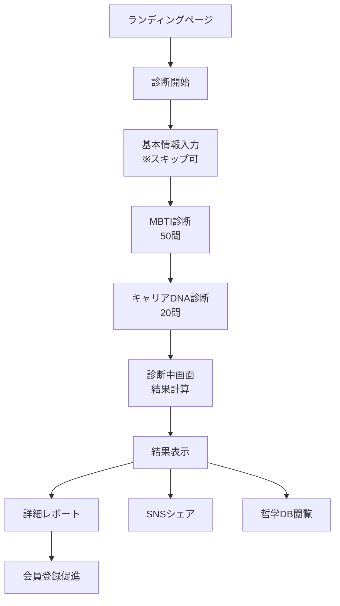

# Cool Career 診断システム設計書

## 概要
Cool Careerの中核機能である「MBTI × キャリアDNA = 80タイプ診断」の全体設計書です。従来のMBTI（16タイプ）に独自のキャリアDNA（5タイプ）を掛け合わせることで、80通りの詳細なキャリアタイプを判定します。

## 診断システムの特徴

### 1. 革新的な80タイプ分類
```
MBTI（16タイプ） × キャリアDNA（5タイプ） = 80タイプ

例：
- INTJ × Pioneer = INTJ-P「革新的な戦略家」
- ENFP × Connector = ENFP-C「情熱的なコネクター」
- ISTJ × Guardian = ISTJ-G「堅実な守護者」
```

### 2. 学術的根拠とエンタメ性の融合
- 心理学・経営学の理論に基づく信頼性
- ゲーム的要素（レア度、相性診断）によるバズ性
- 500人の実データによる実践的な職種推薦

### 3. 継続的な成長支援
- 診断結果の保存と履歴管理
- 3ヶ月ごとの再診断による変化追跡
- キャリアDNAの進化予測

## 診断フロー

### 全体フロー図


### ステップ詳細

#### Step 1: ランディングページ
```
コンテンツ:
- ヒーローセクション
  - キャッチコピー：「5分でわかる、あなたの80タイプキャリアDNA」
  - サブコピー：「MBTI × キャリアDNA = あなただけの天職発見」
  - 診断開始ボタン（大きく、目立つデザイン）

- 信頼性アピール
  - 診断実績：○○万人が診断
  - 学術的根拠：○○大学との共同研究
  - メディア掲載：○○に掲載

- 診断の特徴（3つのポイント）
  1. 世界初の80タイプ分類
  2. 5分で完了する手軽さ
  3. 科学的根拠に基づく精度

- FAQ
  - 無料で診断できますか？ → はい
  - 個人情報は必要ですか？ → 不要です
  - 診断結果は保存できますか？ → 会員登録で可能
```

#### Step 2: 基本情報入力（オプション）
```
入力項目:
- 年代選択
  □ 10代
  □ 20代前半（20-24歳）
  □ 20代後半（25-29歳）
  □ 30代
  □ 40代
  □ 50代以上

- 現在の状況
  □ 学生
  □ 社会人
  □ 転職活動中
  □ その他

- 興味のある業界（複数選択可）
  □ IT・テクノロジー
  □ 金融・コンサル
  □ メーカー
  □ 商社・流通
  □ メディア・広告
  □ 医療・福祉
  □ 教育
  □ その他

※「スキップして診断を始める」ボタンを目立つ位置に配置
```

#### Step 3: MBTI診断（50問）
```
画面構成:
- 上部：プログレスバー（1/70）
- 中央：質問と選択肢
- 下部：戻る/次へボタン

質問表示:
- 1画面1問形式
- アニメーション付き画面遷移
- 10問ごとに励ましメッセージ

選択肢デザイン:
- カード型の選択肢
- ホバー/タップでハイライト
- 選択後、自動で次へ遷移（0.3秒後）
```

#### Step 4: キャリアDNA診断（20問）
```
画面構成:
- プログレスバーが色変化（MBTIパート完了を示す）
- 「あと20問！キャリアDNAを診断中」のメッセージ

質問の特徴:
- より具体的なシチュエーション
- 画像付き選択肢も使用
- 5択形式（DNAタイプに対応）
```

#### Step 5: 診断中画面
```
表示要素:
- ローディングアニメーション（DNAが組み合わさるイメージ）
- 診断中メッセージのローテーション
  - 「あなたのMBTIタイプを分析中...」（1秒）
  - 「キャリアDNAを解析中...」（1秒）
  - 「80タイプから最適なタイプを特定中...」（1秒）
  - 「診断結果を生成中...」（1秒）

所要時間: 合計4秒
```

## 診断結果画面

### メイン結果表示
```yaml
構成要素:
  タイプ表示:
    - 大きなタイプ名: "INTJ-P"
    - キャッチーな名称: "革新的な戦略家"
    - レア度: "★★★★☆ スーパーレア（全体の2.3%）"
    
  ビジュアル要素:
    - タイプアイコン: MBTIとDNAの組み合わせ
    - カラーテーマ: タイプごとの固有色
    - アニメーション: 結果表示時のエフェクト
    
  基本説明:
    - 3行でタイプの特徴を説明
    - 強みTOP3
    - 注意点TOP3
```

### 詳細分析セクション

#### 1. キャリアDNA分析
```yaml
表示内容:
  MBTIスコア:
    - E-I軸: プログレスバーで表示（E 35% ← → I 65%）
    - S-N軸: プログレスバーで表示
    - T-F軸: プログレスバーで表示
    - J-P軸: プログレスバーで表示
    
  キャリアDNA強度:
    - Pioneer: 85%（メイン）
    - Builder: 45%（サブ）
    - Specialist: 30%
    - Connector: 20%
    - Guardian: 15%
    
  総合スコア:
    - 診断の確度: 92%
    - 回答の一貫性: 88%
```

#### 2. 社畜化リスク診断
```yaml
リスクメーター:
  - ビジュアル: 半円形のメーター
  - スコア: 65%（警告レベル）
  - メッセージ: "このままだとあと156日で限界です"
  
危険因子TOP3:
  1. 完璧主義度: 85%
  2. 断れない度: 78%
  3. 承認欲求度: 72%
  
予防アドバイス:
  - 週1回は定時退社する日を作る
  - 断る練習から始める
  - 自己肯定感を高めるワーク
```

#### 3. 推奨キャリアパス
```yaml
天職候補TOP5:
  1. スタートアップCTO
     - マッチ度: 95%
     - 理由: 技術力×ビジョン×独立性
     - 年収レンジ: 800-2000万円
     
  2. プロダクトマネージャー
     - マッチ度: 88%
     - 理由: 戦略性×実行力×革新性
     - 年収レンジ: 600-1200万円

向いている環境:
  - 裁量権の大きい職場
  - 技術革新を重視する企業
  - 少人数のエリートチーム
  
避けるべき環境:
  - 年功序列の強い組織
  - ルーティンワーク中心
  - 過度に協調性を求める文化
```

#### 4. 相性診断
```yaml
相性の良いタイプ:
  ビジネスパートナー:
    - ENFP-C: 情熱的なコネクター
    - 相性度: 92%
    - 理由: ビジョン共有×実行力の補完
    
  チームメンバー:
    - ISTJ-B: 実直なビルダー
    - 相性度: 85%
    - 理由: 構想×実装の役割分担

相性に注意が必要なタイプ:
  - ESFJ-G: 献身的なガーディアン
  - 注意点: 価値観の相違、スピード感の違い
```

## シェア機能

### SNSシェア画像生成
```yaml
画像構成:
  - サイズ: 1200×630px（OGP推奨サイズ）
  - 要素:
    - タイプ名とアイコン
    - レア度表示
    - 特徴的なキーワード3つ
    - QRコード（診断ページへ）
    - Cool Careerロゴ
    
テンプレート:
  - タイプごとの背景色
  - インスタ映えするデザイン
  - ストーリーズ用縦型も生成
```

### シェア文言テンプレート
```
Twitter:
【キャリアDNA診断】
私のタイプは「INTJ-P（革新的な戦略家）」でした！
レア度：★★★★☆ スーパーレア（2.3%）

特徴：
✓ 論理的思考×挑戦精神
✓ 計算されたリスクテイク
✓ 破壊的イノベーター

あなたのキャリアDNAは？
#キャリアDNA診断 #CoolCareer
[URL]

Instagram:
キャプション + ハッシュタグセット
#MBTI #キャリア診断 #自己分析 等
```

## データ分析とフィードバック

### 収集データ
```yaml
診断プロセス:
  - 各質問の回答時間
  - 選択の変更回数
  - 離脱ポイント
  - 完了率
  
結果データ:
  - タイプ分布
  - レア度分布
  - 年代×タイプのクロス集計
  - 業界×タイプのクロス集計
  
エンゲージメント:
  - シェア率
  - 詳細レポート閲覧率
  - 会員登録転換率
  - リピート診断率
```

### A/Bテスト項目
```yaml
診断フロー:
  - 質問順序
  - 質問文言
  - 選択肢の表示方法
  - プログレスバーのデザイン
  
結果表示:
  - レイアウト
  - 情報の表示順序
  - ビジュアル要素
  - CTA配置
  
シェア機能:
  - 画像デザイン
  - シェア文言
  - インセンティブ
```

## 技術仕様

### パフォーマンス要件
- 質問遷移: 100ms以内
- 結果計算: 1秒以内
- 画像生成: 3秒以内
- 同時診断数: 1000人

### データ構造
```typescript
interface DiagnosisSession {
  sessionId: string
  startedAt: Date
  completedAt?: Date
  userInfo?: UserInfo
  mbtiAnswers: Answer[]
  careerDnaAnswers: Answer[]
  result?: DiagnosisResult
}

interface DiagnosisResult {
  mbtiType: MBTIType
  careerDna: CareerDNAType
  combinedType: string // "INTJ-P"
  typeName: string // "革新的な戦略家"
  rarity: Rarity
  scores: DetailedScores
  recommendations: Recommendation[]
  compatibility: Compatibility[]
  shareData: ShareData
}
```

### エラーハンドリング
- セッションタイムアウト（30分）
- 不正な回答の検出
- ネットワークエラー時の回答保存
- 結果生成失敗時のフォールバック

## KPI設定

### 診断完了率
- 目標: 80%以上
- 現状把握: ファネル分析
- 改善: 離脱ポイントの特定と改善

### シェア率
- 目標: 完了者の30%以上
- 施策: インセンティブ設計
- 分析: タイプ別シェア率

### リピート率
- 目標: 3ヶ月以内に30%
- 施策: リマインダー、変化の可視化
- 分析: リピート要因の特定