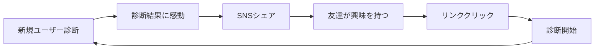

# Cool Career バイラルメカニクス設計書

## 概要

Cool Careerの成長を加速させるバイラルメカニクスの詳細設計です。診断結果を「共通言語」として確立し、ユーザー間の自発的な拡散を促進する仕組みを構築します。

## バイラルループの設計

### 1. コアバイラルループ



#### ループの強化要素
```yaml
診断の価値:
  - 希少性: "あなたは全体の2.3%のレアタイプ！"
  - 発見: "知らなかった自分の一面"
  - 共感: "これ、まさに私だ！"

シェアの動機:
  - 自己表現: "私はこういう人間です"
  - 承認欲求: "レアタイプだと認められたい"
  - 話題提供: "みんなも診断してみて！"

友達の反応:
  - 好奇心: "自分も診断してみたい"
  - 比較: "私とタイプが違うのか"
  - 共感: "同じタイプかもしれない"
```

### 2. 二次バイラルループ

```yaml
相性診断ループ:
  トリガー: 診断完了後の「相性診断」ボタン
  フロー:
    1. 友達のTwitter IDを入力
    2. 友達に診断リクエスト通知
    3. 友達が診断完了
    4. 相性結果を両者に通知
    5. 結果を共同でシェア
  
  バイラル要素:
    - 1人が複数人を巻き込む
    - 相互作用による関係強化
    - 共同シェアで拡散力UP
```

## ゲーミフィケーション要素

### 1. レア度システム

```yaml
レア度ランク:
  ウルトラレア (UR):
    - 出現率: 1%未満
    - 表示: ★★★★★ + キラキラエフェクト
    - 特典: 限定バッジ、特別レポート
    
  スーパーレア (SR):
    - 出現率: 1-3%
    - 表示: ★★★★☆ + 光るエフェクト
    - 特典: SRバッジ、詳細分析
    
  レア (R):
    - 出現率: 3-5%
    - 表示: ★★★☆☆
    - 特典: Rバッジ
    
  アンコモン (UC):
    - 出現率: 5-10%
    - 表示: ★★☆☆☆
    - 特典: なし
    
  コモン (C):
    - 出現率: 10%以上
    - 表示: ★☆☆☆☆
    - 特典: なし

心理効果:
  - 希少性の法則
  - コレクション欲求
  - 優越感の醸成
```

### 2. バッジシステム

```yaml
プロフィールバッジ:
  タイプバッジ:
    - 全80種類のコレクション
    - タイプごとのデザイン
    - Twitter/LinkedInに表示可能
    
  アチーブメントバッジ:
    - 初回診断完了
    - 友達10人を招待
    - 相性診断マスター（50回以上）
    - 3ヶ月連続診断
    - コミュニティリーダー
    
  限定バッジ:
    - アーリーアダプター（最初の1000人）
    - イベント参加
    - 企業コラボ診断
    
表示方法:
  - プロフィール画像の周りに配置
  - SNSシェア画像に自動追加
  - 名刺風画像生成機能
```

### 3. ランキングシステム

```yaml
ランキング種別:
  レアタイプランキング:
    - 最もレアな診断結果TOP100
    - リアルタイム更新
    - 月間/年間集計
    
  招待ランキング:
    - 友達招待数TOP50
    - 週間/月間更新
    - 報酬: プレミアム機能
    
  相性診断ランキング:
    - 診断回数TOP30
    - 高相性ペアTOP10
    - 話題の組み合わせ
    
  タイプ別ランキング:
    - 各タイプ内での活動度
    - コミュニティ貢献度
    - 知識レベル
```

## シェア機能の最適化

### 1. ワンタップシェア

```typescript
interface ShareOptions {
  platform: 'twitter' | 'instagram' | 'line' | 'facebook'
  content: {
    text: string
    image: string
    hashtags: string[]
    mentions?: string[]
  }
  tracking: {
    utmSource: string
    utmMedium: string
    utmCampaign: string
  }
}

// 実装例
const shareToTwitter = async (result: DiagnosisResult) => {
  const shareImage = await generateShareImage(result)
  const shareText = generateShareText(result)
  
  const shareUrl = buildTwitterShareUrl({
    text: shareText,
    url: `${BASE_URL}?ref=${result.userId}`,
    hashtags: ['キャリアDNA診断', result.typeCode]
  })
  
  // トラッキング
  trackShare({
    platform: 'twitter',
    resultType: result.typeCode,
    rarity: result.rarity
  })
  
  window.open(shareUrl)
}
```

### 2. ビジュアルシェア最適化

```yaml
シェア画像バリエーション:
  基本テンプレート:
    - タイプ名を大きく表示
    - レア度を視覚的に表現
    - キーワード3つを配置
    - QRコード埋め込み
    
  ストーリーズ用（9:16）:
    - 縦型デザイン
    - アニメーション対応
    - スワイプアップリンク用
    
  フィード用（1:1）:
    - 正方形デザイン
    - 情報量を調整
    - ブランディング強化
    
  Twitter用（16:9）:
    - 横長デザイン
    - テキスト可読性重視
    - リプライ誘発要素

カスタマイズ要素:
  - 背景色（タイプ別）
  - アイコン（DNA別）
  - フォント（性格別）
  - エフェクト（レア度別）
```

### 3. シェアインセンティブ

```yaml
即時報酬:
  シェア完了:
    - 詳細レポート解放
    - 相性診断1回無料
    - 限定コンテンツアクセス
    
  友達の診断完了:
    - プレミアム機能1週間
    - 特別バッジ付与
    - ポイント付与
    
累積報酬:
  マイルストーン:
    - 5人招待: 月額プラン50%OFF
    - 10人招待: 1ヶ月無料
    - 20人招待: VIPステータス
    
  継続報酬:
    - 毎月の招待数に応じて割引
    - アンバサダープログラム参加権
    - 限定イベント招待
```

## コミュニティ形成

### 1. タイプ別コミュニティ

```yaml
Discord サーバー構成:
  全体チャンネル:
    - welcome: 新規参加者の自己紹介
    - general: 雑談・交流
    - diagnosis-results: 診断結果シェア
    - career-talk: キャリア相談
    
  タイプ別チャンネル:
    - 80個の専用チャンネル
    - タイプ特有の話題
    - 先輩からのアドバイス
    - オフ会企画
    
  特別チャンネル:
    - ultra-rare: URタイプ限定
    - job-hunting: 就活情報交換
    - company-insider: 企業の内部情報
    - mentorship: メンター募集

モデレーション:
  - AIによる自動監視
  - コミュニティマネージャー配置
  - ユーザー投票システム
```

### 2. リアルイベント連動

```yaml
オフラインイベント:
  タイプ別交流会:
    - 月1回、主要都市で開催
    - 同じタイプ同士の深い交流
    - キャリアメンターも参加
    
  相性診断パーティー:
    - 相性の良いタイプをマッチング
    - ビジネスパートナー探し
    - 就活仲間作り
    
  企業×学生マッチング:
    - タイプ別採用イベント
    - 企業文化との相性重視
    - その場で内定も

オンラインイベント:
  週次ウェビナー:
    - タイプ別キャリア戦略
    - 成功者インタビュー
    - Q&Aセッション
    
  診断大会:
    - 友達と同時診断
    - 結果予想ゲーム
    - 賞品付きコンテスト
```

## バイラルコンテンツ戦略

### 1. UGC（User Generated Content）促進

```yaml
コンテンツタイプ:
  診断結果考察:
    - 「私のINTJ-Pあるある」
    - 「このタイプの取扱説明書」
    - 「相性最悪な組み合わせ体験談」
    
  タイプ別Meme:
    - 各タイプの特徴を面白く表現
    - テンプレート提供
    - 優秀作品は公式採用
    
  キャリアストーリー:
    - 診断を活かした就活成功談
    - タイプを理解して転職成功
    - 相性診断で最高のチーム結成

投稿促進施策:
  - ハッシュタグキャンペーン
  - 月間ベスト投稿表彰
  - クリエイター支援プログラム
```

### 2. インフルエンサー活用

```yaml
インフルエンサー戦略:
  Tier 1（100万フォロワー以上）:
    - 診断体験の動画化
    - 結果解説コンテンツ
    - フォロワー限定機能
    
  Tier 2（10-100万フォロワー）:
    - タイプ別代表として活動
    - 定期的な診断コンテンツ
    - コミュニティアンバサダー
    
  Tier 3（1-10万フォロワー）:
    - 就活系アカウント重視
    - 体験談の発信
    - 友達紹介キャンペーン

コラボ企画:
  - タイプ診断リレー
  - 相性診断企画
  - ライブ診断配信
```

## テクニカルバイラル要素

### 1. Open Graph最適化

```html
<!-- 動的OGPタグ生成 -->
<meta property="og:title" content="私のキャリアDNAは「INTJ-P」でした！ | Cool Career">
<meta property="og:description" content="革新的な戦略家タイプ（レア度★★★★☆）あなたのタイプは？">
<meta property="og:image" content="https://coolcareer.jp/share/intj-p-user123.png">
<meta property="og:type" content="website">
<meta property="twitter:card" content="summary_large_image">
```

### 2. ディープリンク戦略

```yaml
リンク構造:
  診断開始: coolcareer.jp/start?ref={userId}
  結果直接: coolcareer.jp/result/{typeCode}
  相性診断: coolcareer.jp/compatibility?user1={id1}&user2={id2}
  
  アプリ対応:
    - Universal Links (iOS)
    - App Links (Android)
    - Fallback to Web
```

### 3. リファラルトラッキング

```typescript
interface ReferralTracking {
  referrerId: string
  source: 'twitter' | 'instagram' | 'line' | 'direct'
  campaign?: string
  timestamp: Date
  conversion: {
    started: boolean
    completed: boolean
    shared: boolean
  }
  lifetime: {
    directReferrals: number
    indirectReferrals: number
    totalImpact: number
  }
}
```

## 成功指標とKPI

### バイラル係数（K-factor）

```yaml
計算式: K = i × c
  i: 各ユーザーが送る招待数
  c: 招待の転換率

目標値:
  Month 1-3: K = 0.8
  Month 4-6: K = 1.2
  Month 7-12: K = 1.5+

改善施策:
  招待数(i)向上:
    - シェアUXの改善
    - インセンティブ強化
    - 複数プラットフォーム対応
    
  転換率(c)向上:
    - ランディングページ最適化
    - 診断開始のハードル低減
    - ソーシャルプルーフ強化
```

### その他の重要指標

```yaml
バイラル指標:
  - Time to Share: 診断完了→シェアまでの時間
  - Share Rate: シェア率（目標30%→50%）
  - Virality Ratio: 1人が何人を連れてくるか
  - Viral Cycle Time: バイラルループ1周の時間

エンゲージメント指標:
  - Community参加率: 20%
  - UGC投稿率: 10%
  - イベント参加率: 5%
  - リピート診断率: 30%（3ヶ月）
```

## 実装優先順位

### Phase 1（MVP）
1. 基本的なSNSシェア機能
2. シェア画像自動生成
3. レア度システム
4. 簡易ランキング

### Phase 2（成長期）
1. 相性診断機能
2. バッジシステム
3. Discordコミュニティ
4. インフルエンサー連携

### Phase 3（拡大期）
1. 高度なゲーミフィケーション
2. イベント連動機能
3. UGCプラットフォーム
4. グローバル展開対応